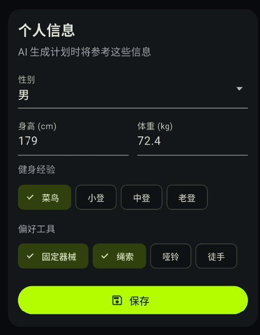
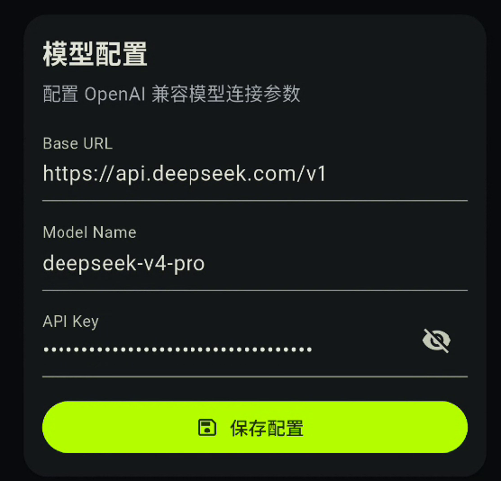
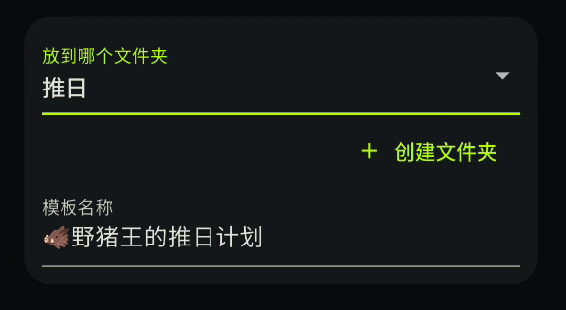
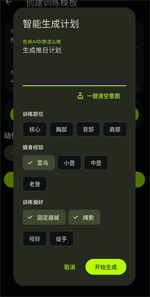
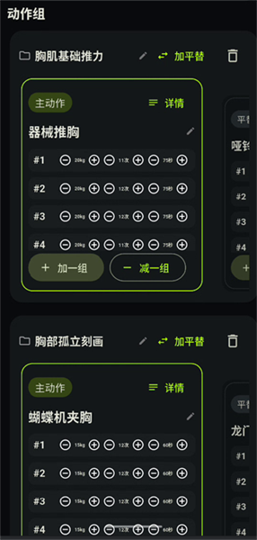
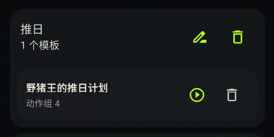
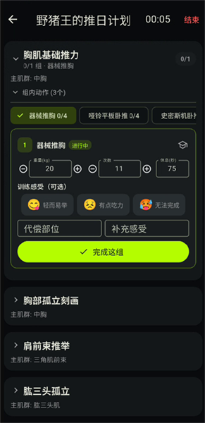
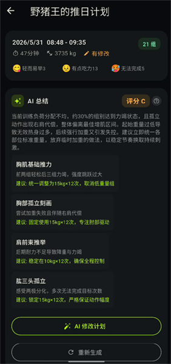

# BMB 大肌霸

你的私人AI教练。

# 🔥 核心亮点

- 🤖 AI全链路集成，一键纵享丝滑。别的App还在点点点，我已经练完了~
  - **训练计划自动制定**：你是小白？懒得花一个晚上做计划？你不想思考？给我30秒，AI将为你量身定制训练计划！
  - **训练效率评估**：不确定本次训练有多大效用？我这样坚持下去可以吗？现阶段该不该调节计划？轻一点 / 重一点？再给我30秒！你的每次训练都有AI完整评估，你将不再迷茫，只是去健身房感动自己的这种事儿也将不再存在。
  - **自动修改模板**：基于训练表现重新规划计划，只需要一次点击。
- 💪 从健身房里诞生的App，满满设计巧思
  - **设备排队**：每组动作都有等效平替动作，健身房爆满？爷哪个都能练！
  - **我练的对吗**：你真不想每次坐在机器上小红书刷半天教程吧。我用最简洁的话把动作要领和常见错误推在你的脸上！别再练错了！
  - **最重要的是训练感受**：只需一次点击！每组动作当下的感受都可以清晰记录！
  - **组间休息计时**：我休息够了吗？每组动作都有科学的休息时间！后台刷小红书也能清晰看到！
- 🔒 数据安全：不上传任何数据到服务器（AI能力会将数据上传到模型提供商）
- 🤑 完全免费：你可以使用任何OpenAI兼容的模型提供商

# 📔 QuickStart

本小节将展示如何快速配置BMB App，创建计划并完成一次训练。对于完整教程，请查看[完整教程](docs/tutorial/ROOT.md)。

## 1. 配置你的基础信息

进入`设置`页，配置你的基础信息。

## 2. 配置模型提供商（可选，用于AI能力）

如需使用AI能力，需配置OpenAI兼容的模型提供商。

推荐模型：

- [deepseek-v4-pro](https://platform.deepseek.com/)
- [qwen3-max](https://bailian.console.aliyun.com/)

## 3. 创建运动模板

点击`模板`页的`开始创建`

输入模板名和文件夹。文件夹被设计成用于维护一组训练目标一致的计划，如推日计划、拉日计划、胸背计划...

点击`智能生成计划`，填写意图，AI基于你的基础信息和训练意图帮你生成计划，意图越清晰计划越精准！

🎉 恭喜你！AI已经帮你创建了一个运动模板！

> AI生成的数据包含多个动作组，每组内包含一个主要训练动作和多个平替动作供你在设备占用时挑选。  
> 每一个动作都会被标记训练的主肌群、辅助肌群、动作要领 以及 常见错误。你可以基于运动模板继续编辑，或直接使用。

## 4. 开始跟练

你可以在模板处点击开始跟练，或在`运动记录`页点击开始跟练

在跟练页面中，你将可以随意添加模板中定义的动作，调整训练配置，填写训练感受。

🎉 恭喜你！你已经完成了一次训练！

本次训练记录将会被永久保存至`运动记录`！

## 5. AI效率评估

在训练结束后，可以选择让AI评估本次训练的效率。

AI会基于最佳增肌效率（而非组数、配重）对训练进行评估，你将再也无法用高配重以及力竭感动自己，也再也不能用低配重来快乐训练。所有低效训练都将无处遁形。

此外，若此计划有历史运动记录，AI还会参考历史运动记录，基于渐进式超负荷对你的表现进行评估，任何进步和退步都能轻易看见。

若当前训练效果不佳，你可能需要针对性的调整计划，点击`AI修改计划`，你可以立刻完成计划的调整！

🎉 恭喜你！你已经学会了BMB的所有核心操作！

# 🧑‍💻 TodoList

- 肌群图像化代替当前的文字，让用户一眼可以看清发力位置
- 教程页快速跳转到小红书、抖音、B站等app，并自动搜索相关动作
- 给健身教练跪下，求持续帮我优化Prompts和流程
- IOS端提供

# 👀 其它

AI生成不能保证100%准确（你的健身教练也不能），请依据个人情况做具体训练计划。
